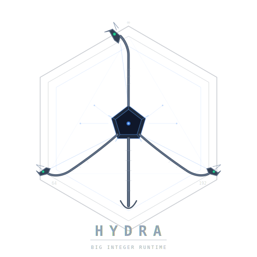

# 🐍 Hydra



**A tiered arbitrary-precision integer for modern C++**
*small values move like native machine integers; large values grow heads.*

Hydra is an experimental **multi-representation integer runtime** designed to preserve the speed of native 64-bit arithmetic while scaling seamlessly into arbitrary precision.

The core idea is simple:

* **small values** stay in the fast machine-word path
* **medium values** use inline fixed limbs
* **large values** spill into a tail-allocated heap representation
* **results normalize downward** into the smallest valid storage class

In other words:

> *pay for complexity only when the value actually needs it*

---

## Visual Hydra Performance Story

<p align="center">
  
</p>

## ✨ Design Goals

Hydra is built around five principles:

### 1) Fast-path sanctity ⚡

Operations on values that fit in 64 bits should compile down to **native arithmetic instructions whenever possible**.

The hot path should look and feel like:

```cpp
Hydra a = 42;
Hydra b = 1337;
Hydra c = a + b;
```

with performance close to:

```cpp
uint64_t c = a + b;
```

---

### 2) Tiered storage heads 🐉

Hydra uses multiple internal representations:

| Head       | Storage              | Use case                                     |
| ---------- | -------------------- | -------------------------------------------- |
| **Small**  | inline 64-bit        | counters, IDs, most arithmetic               |
| **Medium** | inline limbs         | overflow products, fixed-width intermediates |
| **Large**  | tail-allocated limbs | arbitrary precision                          |

This avoids the performance cliff between:

```text
u64 → heap bigint
```

and instead creates a smoother ladder:

```text
u64 → inline limbs → heap bigint
```

---

### 3) Canonical normalization 🧬

Every value is always stored in the **smallest valid representation**.

Examples:

* large result shrinks back to medium
* medium result shrinks back to small
* zero has exactly one canonical form

This keeps equality, hashing, and serialization sane.

---

### 4) Ownership safety 🛡️

Large representations use **tail allocation**:

```text
[ header | limbs... ]
```

to avoid double heap allocations and improve locality.

Temporary heap ownership uses RAII guards internally to remain exception-safe.

---

### 5) Explicit kernel dispatch 🎯

Binary operations dispatch by representation pair:

```text
Small + Small
Small + Medium
Medium + Large
...
```

allowing specialized arithmetic kernels for each case.

Conceptually:

```cpp
add(lhs_kind, rhs_kind)
```

routes into a 2D dispatch matrix.

---

## 🧠 Why Hydra?

Most bigint implementations make a tradeoff:

* either excellent arbitrary precision
* or excellent machine-word performance

Hydra tries to preserve both.

The goal is to make common arithmetic boringly fast while still allowing:

```cpp
Hydra x = factorial(1000);
```

without changing types.

---

## 🔥 Current Architecture

```text
Hydra
├── metadata word (kind / flags / reserved)
├── Small   → inline 64-bit
├── Medium  → inline limb array
└── Large   → pointer to tail-allocated LargeRep
```

Large head layout:

```text
[ used | capacity | limbs... ]
```

---

## 📊 Performance Snapshot

Benchmarks run with Google Benchmark on a single core (Apple M2, clang-18 `-O2`).
Numbers are wall-time per operation; lower is better.
This is a living benchmark diary — figures will shift as kernels mature.

| Operation      | Hydra        | Reference                      | Δ vs reference |
| -------------- | ------------ | ------------------------------ | -------------- |
| small add      | 3.03 ns      | `uint64_t` 2.47 ns             | +22.4%         |
| small mul      | 4.02 ns      | `uint64_t` 3.44 ns             | +16.8%         |
| medium add     | 6.49 ns      | Boost.Multiprecision 9.27 ns   | −30.0%         |
| medium mul     | 21.53 ns     | Boost.Multiprecision 27.07 ns  | −20.4%         |
| large add 256  | 2.69 µs      | Boost.Multiprecision 23.89 ns  | ⚠️ see note    |

The small-path overhead (~20%) reflects the one-time kind-check dispatch that sits in front of native arithmetic; that cost is expected to shrink as the compiler gets more visibility into the inline representation.
The medium-path results are the early encouraging signal: both add and multiply already beat Boost.Multiprecision by a meaningful margin, which validates the tiered design even at this prototype stage.

> **⚠️ Large-add regression — under active investigation.**
> The 256-bit addition path is currently ~112× slower than Boost.Multiprecision.
> This is a known, severe regression believed to originate in the large-head construction or normalization path rather than the arithmetic kernel itself.
> No performance claims are made for the large path until the root cause is identified and fixed.

---

## 🚧 Status

Early design / prototype phase.

Current focus areas:

* [ ] representation contract
* [ ] move / copy correctness
* [ ] normalization rules
* [ ] addition / subtraction kernels
* [ ] multiplication widening path
* [ ] division strategy
* [ ] benchmarking vs `boost::multiprecision::cpp_int`

---

## 💭 Philosophy

Hydra is equal parts systems engineering and monster mythology.

The name fits:

> one interface
> many internal heads
> cut one path off and another grows

---

## 🤝 Contributions / design discussion

This project is intentionally exploratory.

Performance discussions, ownership critiques, allocator experiments, and kernel-design ideas are all welcome.

Especially interested in:

* fixed-limb arithmetic
* SIMD experiments
* allocator strategies
* dispatch design
* compiler-visible fast paths

---

*Hydra is a systems toy, a numeric engine, and a love letter to over-engineered elegance.* 🐍

