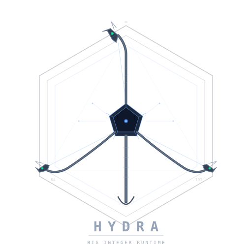
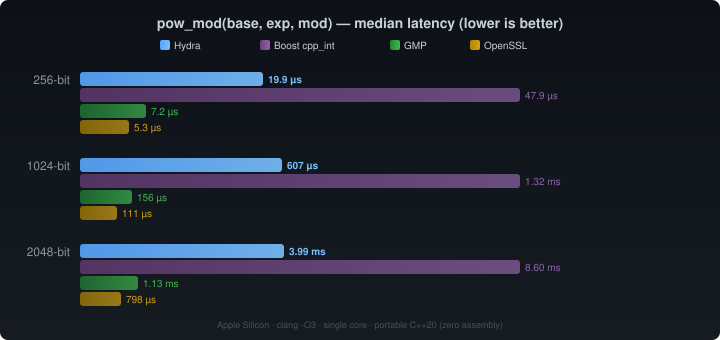
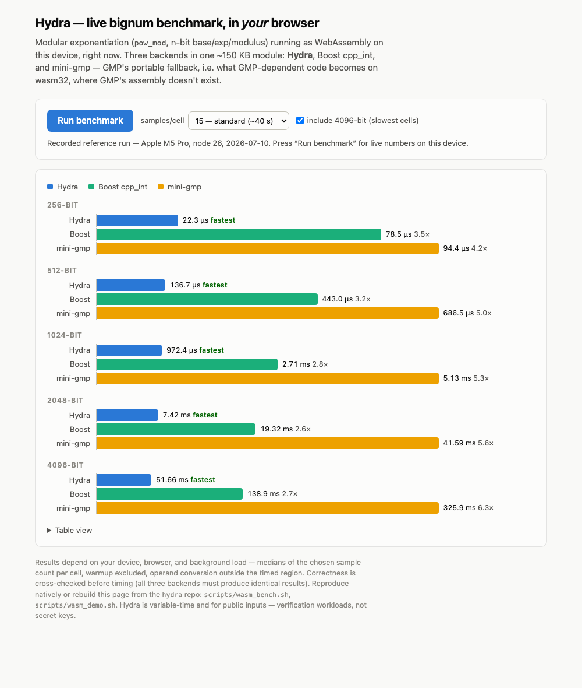

# 🐍 Hydra



[](https://github.com/henry-filgueiras/hydra/actions/workflows/ci.yml)

**A high-performance arbitrary-precision integer library for modern C++**
*competitive modular arithmetic · clean systems-first architecture · small values move at native speed*

Hydra is an experimental **multi-representation integer runtime** designed to preserve the speed of native 64-bit arithmetic while scaling seamlessly into arbitrary precision — with competitive performance on modular exponentiation workloads.

The core idea is simple:

* **small values** stay in the fast machine-word path
* **medium values** use inline fixed limbs
* **large values** spill into a tail-allocated heap representation
* **results normalize downward** into the smallest valid storage class

In other words:

> *pay for complexity only when the value actually needs it*

---

## Quick Example

Toy RSA in six lines — encrypt, decrypt, verify:

```cpp
#include <iostream>
#include "hydra.hpp"
using namespace hydra;

int main() {
    Hydra n("3233");
    Hydra e(17);
    Hydra d(2753);

    Hydra message(65);

    Hydra ciphertext = pow_mod(message, e, n);
    Hydra recovered  = pow_mod(ciphertext, d, n);

    std::cout << "message:    " << message    << "\n";
    std::cout << "ciphertext: " << ciphertext << "\n";
    std::cout << "recovered:  " << recovered  << "\n";
}
```

```text
message:    65
ciphertext: 2790
recovered:  65
```

**Getting Hydra** — it's one header.  Copy `hydra.hpp` into your
project, or via CMake:

```cmake
include(FetchContent)
FetchContent_Declare(hydra
  GIT_REPOSITORY https://github.com/henry-filgueiras/hydra.git
  GIT_TAG        main)
FetchContent_MakeAvailable(hydra)          # exports just hydra_core —
target_link_libraries(app PRIVATE hydra_core)  # no test/bench deps pulled
```

Arbitrary-precision arithmetic just works:

```cpp
Hydra a("123456789012345678901234567890");
Hydra b("-18446744073709551616");

std::cout << a + b << "\n";   // 123456788993898934827525016274
std::cout << gcd(a, b) << "\n";  // 2
```

Primality testing built on the same engine (Baillie–PSW — no known
counterexample, exact below 2⁶⁴):

```cpp
Hydra p = (Hydra(1) << 255) - 19;          // curve25519 field prime
is_probable_prime(p);                      // true, ~0.3 ms
next_prime(Hydra(1) << 256);               // 2^256 + 297, ~0.4 ms
```

---

## ⚡ Performance Snapshot — Modular Exponentiation

<p align="center">
  
</p>

Median latency for `pow_mod(base, exp, mod)` across bit widths — single core, Apple Silicon, clang release build:

| Width | Hydra | Boost `cpp_int` | GMP | OpenSSL |
|------:|:-----:|:---------------:|:---:|:-------:|
|  256  | **19.9 µs** | 47.9 µs | 7.2 µs | 5.3 µs |
| 1024  | **607 µs** | 1.32 ms | 156 µs | 111 µs |
| 2048  | **3.99 ms** | 8.60 ms | 1.13 ms | 798 µs |

Hydra currently delivers:

- **2×–3× faster than Boost.Multiprecision** across 256–4096-bit widths
- within **3×–5× of GMP** (hand-tuned C/asm, decades of optimization)
- within **4×–6× of OpenSSL** (assembly-optimized big-number core)

Achieved via Montgomery reduction, Karatsuba multiplication dispatch, and fast-path modular exponentiation — all in portable C++20 with zero assembly.

<details>
<summary>Full micro-benchmark table (add, mul, shift, div)</summary>

| Operation             | Hydra      | Reference                      | Δ vs reference |
| --------------------- | ---------- | ------------------------------ | -------------- |
| small add             | 3.20 ns    | `uint64_t` 2.49 ns             | +28.1%         |
| small mul             | 4.25 ns    | `uint64_t` 3.55 ns             | +19.9%         |
| widening add          | 3.17 ns    | Boost 11.49 ns                 | −72.4%         |
| widening mul 128-bit  | 0.78 ns    | Boost 9.31 ns                  | −91.6%         |
| medium add            | 5.99 ns    | Boost 13.10 ns                 | −54.3%         |
| medium mul            | 15.30 ns   | Boost 15.55 ns                 | −1.6%          |
| large add 128-bit     | 5.50 ns    | Boost 13.10 ns                 | −58.0%         |
| large add 256-bit     | 13.44 ns   | Boost 13.01 ns                 | +3.3%          |
| large add 512-bit     | 13.55 ns   | Boost 23.98 ns                 | −43.5%         |
| large mul 128-bit     | 15.39 ns   | Boost 15.55 ns                 | −1.0%          |
| large mul 256-bit     | 19.69 ns   | Boost 19.28 ns                 | +2.1%          |
| large mul 512-bit     | 37.13 ns   | Boost 31.43 ns                 | +18.1%         |
| chain large add 64-limb | 394.5 ns | Boost 426.5 ns                 | −7.5%          |

</details>

### 🌐 WebAssembly — fastest bignum you can ship in a browser

Native GMP's speed comes from per-architecture assembly, which doesn't
exist for wasm32 — compile GMP-dependent code to WebAssembly and you
get **mini-gmp**, its portable fallback.  Hydra's performance story is
pure portable C++, so it carries to wasm nearly intact.  Head-to-head
under node (emscripten `-O2`, `pow_mod`, median latency,
`scripts/wasm_bench.sh`):

| Width | **Hydra (wasm)** | Boost cpp_int (wasm) | mini-gmp (wasm) | vs Boost | vs mini-gmp |
|------:|-----------------:|---------------------:|----------------:|---------:|------------:|
|  256  |    **22.3 µs**   |        78.5 µs       |     94.4 µs     |   3.5×   |    4.2×     |
| 1024  |    **972 µs**    |        2.71 ms       |     5.13 ms     |   2.8×   |    5.3×     |
| 2048  |    **7.42 ms**   |        19.3 ms       |     41.6 ms     |   2.6×   |    5.6×     |
| 4096  |    **51.7 ms**   |        139 ms        |      326 ms     |   2.7×   |    6.3×     |

The full 989-test suite passes under wasm with zero source changes
(`scripts/wasm_bootstrap.sh --full`; CI runs it on every push).
Try it yourself: `scripts/wasm_demo.sh --serve` builds a
self-contained page (`demo/`) that runs this exact shootout live in
your browser — three backends, cross-checked for agreement before
timing, ~150 KB total:

<picture>
  <source media="(prefers-color-scheme: dark)" srcset="assets/demo_reference_dark.png">
  
</picture>

---

## Visual Hydra Performance Story

<p align="center">
  
</p>

---

## ✨ Design Goals

Hydra is built around five principles:

### 1) Fast-path sanctity ⚡

Operations on values that fit in 64 bits should compile down to **native arithmetic instructions whenever possible**.

The hot path should look and feel like:

```cpp
Hydra a = 42;
Hydra b = 1337;
Hydra c = a + b;
```

with performance close to:

```cpp
uint64_t c = a + b;
```

---

### 2) Tiered storage heads 🐉

Hydra uses multiple internal representations:

| Head       | Storage              | Use case                                     |
| ---------- | -------------------- | -------------------------------------------- |
| **Small**  | inline 64-bit        | counters, IDs, most arithmetic               |
| **Medium** | inline limbs         | overflow products, fixed-width intermediates |
| **Large**  | tail-allocated limbs | arbitrary precision                          |

This avoids the performance cliff between:

```text
u64 → heap bigint
```

and instead creates a smoother ladder:

```text
u64 → inline limbs → heap bigint
```

---

### 3) Canonical normalization 🧬

Every value is always stored in the **smallest valid representation**.

Examples:

* large result shrinks back to medium
* medium result shrinks back to small
* zero has exactly one canonical form

This keeps equality, hashing, and serialization sane.

---

### 4) Ownership safety 🛡️

Large representations use **tail allocation**:

```text
[ header | limbs... ]
```

to avoid double heap allocations and improve locality.

Temporary heap ownership uses RAII guards internally to remain exception-safe.

---

### 5) Explicit kernel dispatch 🎯

Binary operations dispatch by representation pair:

```text
Small + Small
Small + Medium
Medium + Large
...
```

allowing specialized arithmetic kernels for each case.

Conceptually:

```cpp
add(lhs_kind, rhs_kind)
```

routes into a 2D dispatch matrix.

---

## 🧠 Why Hydra?

Most bigint implementations make a tradeoff:

* either excellent arbitrary precision
* or excellent machine-word performance

Hydra tries to preserve both.

The goal is to make common arithmetic boringly fast while still allowing:

```cpp
Hydra x = factorial(1000);
```

without changing types.

---

## 🔥 Current Architecture

```text
Hydra
├── metadata word (kind / flags / reserved)
├── Small   → inline 64-bit
├── Medium  → inline limb array
└── Large   → pointer to tail-allocated LargeRep
```

Large head layout:

```text
[ used | capacity | limbs... ]
```

---

---

## 🚧 Status

Active development — core arithmetic is implemented and benchmarked.

Completed:

* [x] representation contract (three-tier Small / Medium / Large)
* [x] move / copy correctness
* [x] normalization rules
* [x] addition / subtraction kernels
* [x] multiplication (widening, hand-unrolled 256-bit and 512-bit kernels)
* [x] bit-shift operators (`<<` / `>>`)
* [x] full Hydra÷Hydra division via Knuth Algorithm D (`divmod` / `div` / `mod`)
* [x] signed arithmetic (sign-magnitude representation)
* [x] native interop (implicit conversion from all integral types)
* [x] string parse / format with chunked base-10¹⁸ extraction
* [x] Karatsuba multiplication (production-dispatched at ≥32 limbs)
* [x] number theory primitives (`gcd`, `extended_gcd`, `pow_mod`)
* [x] primality: `is_probable_prime` (Baillie–PSW), `next_prime`, `isqrt`
* [x] benchmarking vs `boost::multiprecision::cpp_int`

* [x] WebAssembly: full test suite + pow_mod shootout vs mini-gmp/Boost (`scripts/wasm_bootstrap.sh`, `scripts/wasm_bench.sh`)
* [x] `llms.txt` — compact machine-readable project digest (API, internals map, perf identity) for AI agents and quick onboarding

Active roadmap:

* [ ] wasm CI job (bootstrap + test + shootout on a runner)
* [ ] Toom-Cook multiplication for ≥128-limb operands
* [ ] arena-backed Karatsuba scratch (may lower threshold to 16 limbs)
* [ ] `std::hash<Hydra>` specialisation
* [ ] PMR-style allocator hook

> **Not constant-time.** Hydra is variable-time by design and assumes
> public inputs.  It is well-suited to verification workloads (RSA
> signature verification, VDFs, accumulators), primality testing, and
> general bignum arithmetic — not to secret-key operations.

---

## 💭 Philosophy

Hydra is equal parts systems engineering and monster mythology.

The name fits:

> one interface
> many internal heads
> cut one path off and another grows

---

## 🤝 Contributions / design discussion

This project is intentionally exploratory.

Performance discussions, ownership critiques, allocator experiments, and kernel-design ideas are all welcome.

Especially interested in:

* fixed-limb arithmetic
* SIMD experiments
* allocator strategies
* dispatch design
* compiler-visible fast paths

---

*Hydra is a systems toy, a numeric engine, and a love letter to over-engineered elegance.* 🐍

