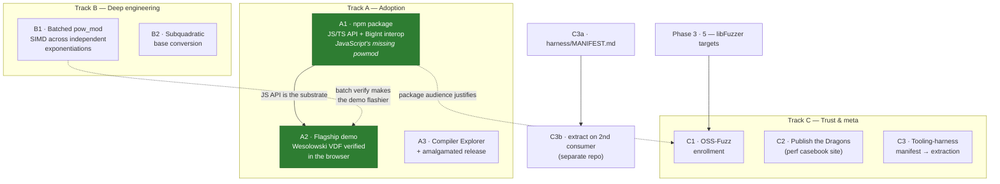

# Hydra Roadmap — Moonshot Tracks

_Catalogued 2026-07-10.  This extends the "Phase 3 Roadmap" in
`DIRECTORS_NOTES.md` (adoption backlog) with larger, direction-setting
bets.  Tracks are labeled for cross-reference; each item lists what it
unblocks, a concrete first step, and the measurement that decides
whether it worked.  Statuses live here — update this file when an item
moves._

## Dependency graph

Solid arrows are prerequisites; dashed arrows are "enhances, not
required".  A3, B1, B2, C2 have no prerequisites and can start any
time.  **A1 landed 2026-07-10** (npm publish itself left to a human);
**A2 landed 2026-07-11**.

## Track A — Adoption

### A1 · npm package: become JavaScript's missing `powmod` — **done except `npm publish` (human step)**

_2026-07-10 outcome: `pkg/` ships `hydra-bignum` — pure `bigint→bigint`
API (powMod, modInverse, gcd, isProbablePrime, nextPrime, isqrt,
isPerfectSquare), 151-check node suite, CI job, ~96 KB dist.  Headline
(node 26, M5 Pro): **2.6×/2.0×/1.5×/1.3× faster than native BigInt at
256/512/1024/2048-bit; honest 0.8× at 4096** (V8 multiplies
subquadratically — Toom-Cook is Track B fodder).  Big side discovery:
emcc's post-link `wasm-opt -O2` pessimizes Hydra kernels up to 60 % —
the package ships an LLVM-only pipeline; the shootout was re-benched
under it same-day (**vs mini-gmp 4.2–6.3× → 5.0–7.4×**, tables
updated); remaining follow-up: migrate the live demo to the fixed
pipeline + re-record its reference results and README screenshots.
Publishing to npm is deliberately left to a human (account, name
claim, provenance)._
JS `BigInt` has no modular-exponentiation primitive; `(a ** e) % m` is
non-modular and hand-rolled square-and-multiply over BigInt is slow and
allocation-heavy.  Hydra is already the fastest bignum measured in wasm
(4.2–6.3× mini-gmp, 2.6–3.5× Boost — see `perf_snapshot.md`), and the
demo already ships a SINGLE_FILE module.  The gap is a consumable API.

- **Deliverables:** embind bindings; TypeScript wrapper with
  `BigInt ⇄ Hydra` interop (BigUint64Array limbs — `from_limbs` /
  `limb_view` already exist for exactly this); typings; npm package
  skeleton (publish is a human decision, not CI's).
- **Headline measurement:** `powMod` and `isProbablePrime` vs native
  V8 `BigInt` implementations at 256/1024/2048/4096-bit, min-of-medians
  protocol.  A comparison nobody has run credibly; win or lose, the
  number anchors the README.
- **Unblocks:** A2 (the demo page consumes this API); justifies C1.

### A2 · Flagship demo: verify a Wesolowski VDF in the browser — **done 2026-07-11**

_2026-07-11 outcome: `demo/vdf/` — `vdf.mjs` (Wesolowski core in ~150
lines of plain JS on top of the A1 package, dependency-injected so it
runs identically in the page and under node), `index.html` (chunked
visible squarings with live rate/ETA, naive chunked prover, verify
timed on the same thread, one-bit tamper button, transcript view), a
42-check node suite (oracle identities, chunk-size invariance, tamper
rejection — wired into CI), and `scripts/wasm_vdf_demo.sh` which
assembles it under the Pages deploy at `/vdf/` (CI green + live page
verified end-to-end in headless Chrome, 2026-07-11).  Measured headline
(M5 Pro, headless Chrome, defaults 2048-bit N · T=2²⁰): **evaluate
2.5 s · prove 5.4 s · verify 2.1 ms → 1,182× faster than the delay it
certifies**; ~1.57M sq/s at 1024-bit.  The naive prover lands at the
predicted ≈2× the evaluation.  B1 batch verification remains a future
flourish (a single verify has two distinct exponents — tier 1 doesn't
apply; batching across many proofs would)._
Every primitive exists already (`pow_mod`, `next_prime` for the
Fiat–Shamir prime challenge, divmod).  A page that generates a VDF
proof slowly and visibly — that's the point of a VDF — then verifies it
in milliseconds turns benchmark bars into "the library doing the thing
it was built for, in front of you".  This is Phase 3 item 3 (honest
niches) made executable instead of textual.

- **Prereq:** A1 (JS API).  **Enhanced by:** B1 (batch verification).
- **First step:** Wesolowski verify in ~100 lines of TS on top of A1;
  prover can be deliberately naive.

### A3 · Compiler Explorer + single-file release
Get `hydra.hpp` into godbolt's library list; "Try it on Compiler
Explorer" link with a preloaded example at the top of the README;
version-stamped amalgamated release asset.  Time-to-first-compile for
a curious C++ dev drops to zero.  Cheapest item on this list relative
to impact; no prerequisites.

## Track B — Deep engineering

### B1 · Batched `pow_mod` — interleave independent exponentiations — **tier 1 LANDED 2026-07-10**

_Shipped: `pow_mod_batch(bases, exp, mod)` — fused 2-lane Montgomery
ladder, **1.33× @2048-bit / 1.38× @4096-bit** e2e throughput vs
single-op, exact pow_mod semantics per element, 1058/1058 tests
(native + wasm).  Key e2e findings: one kernel serves both mul and
sqr (fused halved-sqr loses to sqr-as-fused-mul), and squarings must
flush in pointer-invariant runs (~20%/mul tax otherwise).  Remaining
ideas below stay open: tier 2 (shared mod, divergent exps), the k=64
L1 gap (1.38× e2e vs 1.50× kernel), catching single-op GMP (needs
~1.7× — tier 2 + halved-sqr-style MAC reduction inside the fused
kernel is the plausible route).  Full record in DIRECTORS_NOTES._
The hard-won rule says single-op asm/PGO are measured nulls; don't
retry **without a structural change**.  Batching is the structural
change: verification workloads (signature batches, accumulator checks,
VDF aggregation) present many independent modexps, and 2–4 interleaved
Montgomery ladders break the serial dependency chain that made
single-op NEON a null.

_2026-07-10 probe result (`bench/probe_mont_interleave.cpp`): fused
2-lane FIOS = **1.54× throughput at 2048-bit, 1.50× at 4096-bit**
(native M5 Pro); call-level interleaving is a null (fused kernel
required); 4 lanes ≈ 2 lanes (register ceiling — 2 is the design
point); **wasm is a null** (1.02–1.08×, i128 lowering burns the
registers).  Remaining before an API: fused×2 of the halved squaring
(the ladder is mostly squarings at k≤32), then e2e A/B watching for
cadence inversion.  Full write-up in DIRECTORS_NOTES._

- **API sketch (tiered):** tier 1 `pow_mod_batch(span<const Hydra>
  bases, exp, mod)` — shared exponent+modulus, the RSA-verify/VDF
  shape, perfect lockstep + one Montgomery context; tier 2 shared
  modulus only (squarings stay lockstep, window multiplies predicated
  per lane, pad to max exponent width); tier 3 general N×(b,e,m)
  sugar that groups by (mod, width).  Structure-of-arrays padded
  layout (N×k limbs per operand) — forward-compatible with a future
  32/52-bit-limb vector backend.
- **Measurement:** `probe_mont_interleave` first (1/2/4 interleaved
  Montgomery muls × k = 4..64, MACs/cycle) — kills or funds the idea
  before any API exists.  Then e2e throughput vs N× single-op,
  existing harness (`--runs`, min-of-medians).  Target: ≥1.5×
  throughput at 2048-bit (would put batched Hydra ahead of single-op
  GMP).  Include a wasm lane: it could flip the 4096-bit npm story
  vs native BigInt.
- **Risk:** honest chance of a null result (2 lanes of FIOS state vs
  31 GPRs — register spill can eat the ILP win); log it as a Dragon
  either way.
- **Full design notes:** see "Batched pow_mod — Design Digression"
  in DIRECTORS_NOTES (2026-07-10): why ILP-across-lanes is the
  structural change the single-op asm nulls demand, the no-vector-
  64×64→128 trap on NEON/wasm-SIMD128, the JS microtask auto-
  coalescing aggregator for the npm package, and the security
  framing (defense in depth, never a constant-time claim).

### B2 · Subquadratic base conversion
`to_string` is chunked base-10^18 but still linear in divisions;
divide-and-conquer conversion is a contained, well-understood win.
Rainy-day PR, not a moonshot.

## Track C — Trust & meta

### C1 · OSS-Fuzz enrollment
Phase 3 item 5 (local libFuzzer targets) is the prerequisite; the
moonshot is acceptance into Google OSS-Fuzz — continuous fuzzing on
their compute and the strongest trust signal a crypto-adjacent C++
library can display.  The differential oracles (Montgomery-vs-naive,
`q*b + r == a`) make targets nearly free.

### C2 · Publish the Dragons
`DIRECTORS_NOTES.md` holds a complete record of *failed* optimizations
with measurements (SOS, asm leaf kernels, PGO, Karatsuba-Montgomery —
all honest nulls).  A static "performance engineering casebook"
generated from Resolved Dragons is content that almost never gets
published, and markets the library's rigor better than any table.

### C3 · Tooling-harness extraction (manifest first)
The reusable patterns built here — min-of-medians bench protocol,
sha-pinned dependency fetchers, wasm bootstrap, the CI matrix shape,
the `llms.txt`/`DIRECTORS_NOTES.md` convention itself — are candidates
for a project-agnostic harness.  **Rule: don't templatize before a
second consumer exists** (that's how harnesses ossify around one
project's quirks).

- **C3a (cheap, any time):** `harness/MANIFEST.md` inventorying each
  pattern with one line on what it assumes.
- **C3b (deferred):** when a second project wants a piece, extract
  that piece into a separate tooling repo, with Hydra as guinea pig.

## Sequencing

1. **A1** — compounds everything already built; creates the audience. ✅
2. **A3** — near-zero cost, slot in anywhere.
3. **B1** — next real engineering sprint. ✅ (tier 1)
4. **A2** — ties A1 + B1 together as the flagship demo. ✅
5. **C1 / C2 / C3a** — opportunistic palate-cleansers.

Explicitly still deferred (unchanged from Phase 3): constant-time
hardened profile (needs a concrete consumer), Python bindings (follow
demand after the wasm/npm story), sub-quadratic division (no workload
asks).
