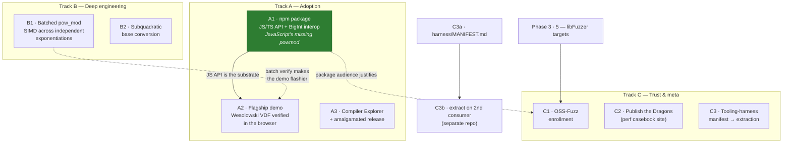

# Hydra Roadmap — Moonshot Tracks

_Catalogued 2026-07-10.  This extends the "Phase 3 Roadmap" in
`DIRECTORS_NOTES.md` (adoption backlog) with larger, direction-setting
bets.  Tracks are labeled for cross-reference; each item lists what it
unblocks, a concrete first step, and the measurement that decides
whether it worked.  Statuses live here — update this file when an item
moves._

## Dependency graph

Solid arrows are prerequisites; dashed arrows are "enhances, not
required".  A3, B1, B2, C2 have no prerequisites and can start any
time.  **A1 landed 2026-07-10** (npm publish itself left to a human);
A2 is unblocked.

## Track A — Adoption

### A1 · npm package: become JavaScript's missing `powmod` — **done except `npm publish` (human step)**

_2026-07-10 outcome: `pkg/` ships `hydra-bignum` — pure `bigint→bigint`
API (powMod, modInverse, gcd, isProbablePrime, nextPrime, isqrt,
isPerfectSquare), 151-check node suite, CI job, ~96 KB dist.  Headline
(node 26, M5 Pro): **2.6×/2.0×/1.5×/1.3× faster than native BigInt at
256/512/1024/2048-bit; honest 0.8× at 4096** (V8 multiplies
subquadratically — Toom-Cook is Track B fodder).  Big side discovery:
emcc's post-link `wasm-opt -O2` pessimizes Hydra kernels up to 60 % —
the package ships an LLVM-only pipeline; **follow-up: re-bench the
shootout + demo under the same pipeline** (perf_snapshot tables are
currently understated).  Publishing to npm is deliberately left to a
human (account, name claim, provenance)._
JS `BigInt` has no modular-exponentiation primitive; `(a ** e) % m` is
non-modular and hand-rolled square-and-multiply over BigInt is slow and
allocation-heavy.  Hydra is already the fastest bignum measured in wasm
(4.2–6.3× mini-gmp, 2.6–3.5× Boost — see `perf_snapshot.md`), and the
demo already ships a SINGLE_FILE module.  The gap is a consumable API.

- **Deliverables:** embind bindings; TypeScript wrapper with
  `BigInt ⇄ Hydra` interop (BigUint64Array limbs — `from_limbs` /
  `limb_view` already exist for exactly this); typings; npm package
  skeleton (publish is a human decision, not CI's).
- **Headline measurement:** `powMod` and `isProbablePrime` vs native
  V8 `BigInt` implementations at 256/1024/2048/4096-bit, min-of-medians
  protocol.  A comparison nobody has run credibly; win or lose, the
  number anchors the README.
- **Unblocks:** A2 (the demo page consumes this API); justifies C1.

### A2 · Flagship demo: verify a Wesolowski VDF in the browser
Every primitive exists already (`pow_mod`, `next_prime` for the
Fiat–Shamir prime challenge, divmod).  A page that generates a VDF
proof slowly and visibly — that's the point of a VDF — then verifies it
in milliseconds turns benchmark bars into "the library doing the thing
it was built for, in front of you".  This is Phase 3 item 3 (honest
niches) made executable instead of textual.

- **Prereq:** A1 (JS API).  **Enhanced by:** B1 (batch verification).
- **First step:** Wesolowski verify in ~100 lines of TS on top of A1;
  prover can be deliberately naive.

### A3 · Compiler Explorer + single-file release
Get `hydra.hpp` into godbolt's library list; "Try it on Compiler
Explorer" link with a preloaded example at the top of the README;
version-stamped amalgamated release asset.  Time-to-first-compile for
a curious C++ dev drops to zero.  Cheapest item on this list relative
to impact; no prerequisites.

## Track B — Deep engineering

### B1 · Batched `pow_mod` — SIMD across independent exponentiations
The hard-won rule says single-op asm/PGO are measured nulls; don't
retry **without a structural change**.  Batching is the structural
change: verification workloads (signature batches, accumulator checks,
VDF aggregation) present many independent modexps, and 2–4 interleaved
Montgomery ladders break the serial dependency chain that made
single-op NEON a null.

- **API sketch:** `pow_mod_batch(std::span<const Hydra> bases, exp,
  mod)` (shared exp/mod first — the verification shape).
- **Measurement:** throughput (ops/s) vs N× single-op at crypto
  widths, existing probe/A-B harness (`--runs`, min-of-medians).
  Target: ≥1.5× throughput at 2048-bit, which would put batched Hydra
  ahead of single-op GMP.
- **Risk:** honest chance of a null result; log it as a Dragon either
  way.

### B2 · Subquadratic base conversion
`to_string` is chunked base-10^18 but still linear in divisions;
divide-and-conquer conversion is a contained, well-understood win.
Rainy-day PR, not a moonshot.

## Track C — Trust & meta

### C1 · OSS-Fuzz enrollment
Phase 3 item 5 (local libFuzzer targets) is the prerequisite; the
moonshot is acceptance into Google OSS-Fuzz — continuous fuzzing on
their compute and the strongest trust signal a crypto-adjacent C++
library can display.  The differential oracles (Montgomery-vs-naive,
`q*b + r == a`) make targets nearly free.

### C2 · Publish the Dragons
`DIRECTORS_NOTES.md` holds a complete record of *failed* optimizations
with measurements (SOS, asm leaf kernels, PGO, Karatsuba-Montgomery —
all honest nulls).  A static "performance engineering casebook"
generated from Resolved Dragons is content that almost never gets
published, and markets the library's rigor better than any table.

### C3 · Tooling-harness extraction (manifest first)
The reusable patterns built here — min-of-medians bench protocol,
sha-pinned dependency fetchers, wasm bootstrap, the CI matrix shape,
the `llms.txt`/`DIRECTORS_NOTES.md` convention itself — are candidates
for a project-agnostic harness.  **Rule: don't templatize before a
second consumer exists** (that's how harnesses ossify around one
project's quirks).

- **C3a (cheap, any time):** `harness/MANIFEST.md` inventorying each
  pattern with one line on what it assumes.
- **C3b (deferred):** when a second project wants a piece, extract
  that piece into a separate tooling repo, with Hydra as guinea pig.

## Sequencing

1. **A1** — compounds everything already built; creates the audience.
2. **A3** — near-zero cost, slot in anywhere.
3. **B1** — next real engineering sprint.
4. **A2** — ties A1 + B1 together as the flagship demo.
5. **C1 / C2 / C3a** — opportunistic palate-cleansers.

Explicitly still deferred (unchanged from Phase 3): constant-time
hardened profile (needs a concrete consumer), Python bindings (follow
demand after the wasm/npm story), sub-quadratic division (no workload
asks).
